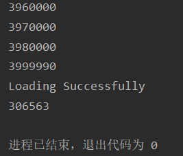

# CS307 Project 1 Report

## Task 1
**The general structure of the database**

###Tables:
- **course:** stores the course information. Columns **pre_course_names** and **truth_table** stores the prerequisite course boolean function.
- **class:** each course contains many classes. In this table, we have **course_id** as a foreign key to express this relation.
- **class_list:** each class has many class lists, usually two. In this table, we have **class_id** as a foreign key to express this relation. This table also stores the information about the class lists.
- **teacher:** stores each teacher's id and names.
- **class_teacher:** The relation between classes and teachers. Because each class may have several teachers and each teacher may teach several classes
- **student:** stores information about student
- **course_selection:** The relation between courses and students. Clearly, each course has several students and each student selects several courses.
**********************************************
## Task 2
### Preparation
- Prepare the connect information in the `jdbc.properties` file, then load it in the `getConnection()` method.
- Prepare the `closeResources()` method, which closes several `Statements` and one `Connection`
### Load course_info.json
**Step 1:** Extract the information for table `course` by constructing the `Course` class and using Gson.
An important method in `Course` class is `standardize()` , which standardizes the `prerequisite` string to `preCourseNames` and `truthTable`.
``` Java
public void standardize(){
    if(prerequisite!=null && prerequisite.length()>0){
        //1.去除课程名中的空格，将中文括号改为英文括号
        prerequisite=prerequisite.replace('（','(').replace('）',')')
                            .replace("SUSTech English ","SUSTech_English_")
                            .replace("大学物理 B","大学物理B")
                            .replace("化学原理 A","化学原理A")
                            .replace("化学原理 B","化学原理B")
                            .replace("学术英语 ","学术英语")
                            .replace("生理学与病理生理学 I","生理学与病理生理学I")
                            .replace("线性代数I A","线性代数I-A");
        //2.生成prerequisiteCoursesNames
        String[] temp=prerequisite.split(" ");
        ArrayList<String> courses = new ArrayList<>();
        for (String s : temp) {
            //去除“或者”、“并且”
            if(!s.equals("或者") && !s.equals("并且") && !s.equals("")){
                //去除单独括号&前后括号，并防止hasDoubleBracket的情况出现
                while(true){
                    if(s.startsWith("(")){
                        s=s.substring(1);
                        continue;
                    }
                    if(!hasDoubleBracket(s)){
                        s=s.substring(0,s.length()-1);
                        continue;
                    }
                    break;
                }
                if(!courses.contains(s)){
                    courses.add(s);
                }
                //防止重复添加课程名
            }
        }
        //将courses按名称长度降序排序，目的是避免3.1替换时出现：化学原理→化学原理实验→化学原理实验A(先替换前面的会有bug)的情况
        courses.sort((o1, o2) -> o2.length() - o1.length());
        preCoursesNames=courses.toArray(new String[0]);
        //3.构建truthTable
        //3.1将prerequisite公式化为formulatedPrerequisite
        String formulatedPre =prerequisite;
        for (int i = 0; i < preCoursesNames.length; i++) {
            formulatedPre = formulatedPre.replace(preCoursesNames[i],String.valueOf((char)('A'+i)));
            //最后替换A
        }
        formulatedPre = formulatedPre.replace(" 并且 ","&")
                                                 .replace(" 或者 ","|");
        //3.2生成truthTable
        //3.2.1用逆波兰算法生成后缀表达式
        Stack<Character> stack = new Stack<>();
        StringBuilder sb = new StringBuilder();
        char[] chars = formulatedPre.toCharArray();
        for (char c : chars) {
            switch (c) {
                case '(' -> stack.push('(');
                case ')' -> {
                    char top;
                    while ((top = stack.pop()) != '(') {
                        sb.append(top);
                    }
                }
                case '&' -> {
                    if (!stack.isEmpty() && stack.peek() == '&') {
                        sb.append(stack.pop());
                    }
                    stack.push('&');
                }
                case '|' -> {
                    if (!stack.isEmpty() && stack.peek() == '&') {
                        sb.append(stack.pop());
                    }
                    if (!stack.isEmpty() && stack.peek() == '|') {
                        sb.append(stack.pop());
                    }
                    stack.push('|');
                }
                default ->//对应于字母A,B,C...
                sb.append(c);
            }
        }
        while (!stack.isEmpty()){
            sb.append(stack.pop());
        }
        char[] postfix=sb.toString().toCharArray();
        truthTable=new Boolean[(int)Math.pow(2, preCoursesNames.length)][1+ preCoursesNames.length];
        for (int i = 0; i < Math.pow(2, preCoursesNames.length); i++) {
            //3.2.2构建每行的真值表的变量取值
            for (int j = 0; j < truthTable[0].length - 1; j++) {
                truthTable[i][j]=(i&(1<<j))!=0;
                //判断i的第j+1位是否为1
            }
            //3.2.3用栈计算后缀表达式
            Stack<Boolean> stack2 = new Stack<>();
            for (char c : postfix) {
                switch (c) {
                    case '|' -> stack2.push(stack2.pop() | stack2.pop());
                    case '&' -> stack2.push(stack2.pop() & stack2.pop());
                    default -> stack2.push(truthTable[i][c - 'A']);
                }
            }
            truthTable[i][truthTable[0].length - 1]=stack2.pop();
        }
    }
}
```
After the standardization, store the courses in `HashSet` to filtrate the duplicate information of courses.

**Step 2: Decouple the data of json file to different tables' information**
This step extracts the data for table `class, class_list, teacher, class_teacher`
``` Java
List<Clazz> classes=generateList("Clazz");//classes最终导入数据库
List<ClassList> classLists = new ArrayList<>();//classLists最终导入数据库
HashMap<String,Integer> teachers = new HashMap<>();//teachers最终导入数据库,String=老师名，int=id
ArrayList<ClassTeacher> classTeachers = new ArrayList<>();//classTeachers最终导入数据库
int classIdCount=0;
int teacherIdCount=32010000;//模拟真实情况
for (Clazz clazz : classes) {
    //1.设定class自身id
    clazz.setId(++classIdCount);
    //2.生成teachers和classTeachers
    clazz.splitTeacherNames();
    if(clazz.getTeacher()!=null){
        for (String teacherName : clazz.getTeacherNames()) {
            //如果teachers中已经不包含该教师，则添加入teacher
            if (!teachers.containsKey(teacherName)) {
                teachers.put(teacherName, ++teacherIdCount);
            }
            //添加每一条class_teacher映射
            classTeachers.add(new ClassTeacher(classIdCount, teachers.get(teacherName)));
        }
    }
    //3.生成classLists
    for (ClassList cl : clazz.getClassList()) {
        cl.splitClassTime();
        cl.setClassId(classIdCount);
        classLists.add(cl);
    }
}
```
**Step 3:** After preparing all the data, we just need to load it to the database by constructing `PreparedStatements` and `execute()` them.
> PS: Because the data size of json file is small, we don't compare the loading efficiency of different methods in this section.
### Load select_course.csv
Generally, we split the information in csv file to prepare for the tables `course_selection, student` by using the following script.
```Java
BufferedReader reader = new BufferedReader(new FileReader(pathToCsvFile));
while((line=reader.readLine())!=null){
    String[] info=line.split(",");
    //导入表student中的数据
    int studentId=Integer.parseint(info[3]);
    char gender=info[1].charAt(0);
    char chineseSurname=info[0].charAt(0);
    String chineseGivenName=info[0].substring(1);
    String englishName=info[2].substring(5,info[2].length()-1);
    String translatedEnglishName=info[2].substring(0,4);
    //导入表course_selection中的数据
    for (int i = 4; i < info.length; i++) {
        String courseId=info[i];
    }
}
```
#### Method 1
This method only use `Statement` to load data.
```Java
Statement st=con.createStatement();
String sql="insert into student(id,gender,chinese_surname,chinese_given_name,english_name,translated_english_name)" +
                        "values("+studentId+",'"
                                    +gender+"','"
                            +chineseSurname+"','"
                            +chineseGivenName+"','"
                                +englishName+"','"
                            +translatedEnglishName+"')";
st.execute(sql);
```
This method costs 7534264 ms, so the efficiency is too slow.
#### Method 2
This method use `PreparedStatement`, which is faster than `Statement` because `PreparedStatement` is **recompiled**.
```Java
while((line=reader.readLine())!=null){
    String sql="insert into student(id,gender,chinese_surname,chinese_given_name,english_name,translated_english_name) values(?,?,?,?,?,?)";
    PreparedStatement ps=con.prepareStatement(sql);
    ps.setObject(1,studentId);
    ps.setObject(2,gender);
    ps.setObject(3,chineseSurname);
    ps.setObject(4,chineseGivenName);
    ps.setObject(5,englishName);
    ps.setObject(6,translatedEnglishName);
    ps.execute();
}
```
This method costs 6762351 ms. Compared with method 1, the efficiency is improved by 10.2%, which isn't obvious.
### Method 3
This method reuses only one `PreparedStatement`, which is generated out of the loop, so it saves the cost of generating `PreparedStatement` from SQL.
```Java
String sql="insert into student(id,gender,chinese_surname,chinese_given_name,english_name,translated_english_name) values(?,?,?,?,?,?)";
ps=con.prepareStatement(sql);
while((line=reader.readLine())!=null){
    ps.setObject(1,studentId);
    ps.setObject(2,gender);
    ps.setObject(3,chineseSurname);
    ps.setObject(4,chineseGivenName);
    ps.setObject(5,englishName);
    ps.setObject(6,translatedEnglishName);
    ps.execute();
}
```
This method costs 6436215 ms. Compared with method 2, the efficiency is improved by 4.8%, which isn't obvious.
### Method 4
This method uses **batched execute** to improve efficiency.
```Java
while((line=reader.readLine())!=null){
    ps1.addBatch();
    count1++;
    if(count1%batchSize==0){
        ps1.executeBatch();
        ps1.clearBatch();
    }
}
```
This method costs 343098 ms. Compared with method 3, the efficiency is improved by 94.7%, the effect is very obvious.
### Method 5
This method closes `AutoCommit` to improve the efficiency.
```Java
con.setAutoCommit(false);
while((line=reader.readLine())!=null){
    ps1.addBatch();
    count1++;
    if(count1%batchSize==0){
        ps1.executeBatch();
        ps1.clearBatch();
    }
}
con.commit();
```
This method costs 306563 ms. Compared with method 4, the efficiency is improved by 10.8%, which isn't obvious.

**From the experiments above, we can see that the major enhancement of loading efficiency comes from the batch execute.**
**************************************************
## Task 3
1. select the course taught by "张伟"
```SQL
select course.id,course.name,course.course_credit,course.course_hour
from teacher
    join class_teacher on teacher.id = class_teacher.teacher_id
                       and teacher.name='张伟'
    join class on class_teacher.class_id = class.id
    join course on class.course_id = course.id;
```


2. select the student's course selection whose id is 11000019
```SQL
select c.id,c.name
from student
     join course_selection cs on student.id = cs.student_id
          and student_id=11000019
     join course c on cs.course_id = c.id;
```


3. Use regex to delete the teachers with names ending with "外聘教师" or "外聘老师"
```SQL
delete
from class_teacher
where teacher_id in (
    select id
    from teacher
    where name ~ '外聘[老|教]师$'
);
delete
from teacher
where name ~ '外聘[老|教]师$';
```


We can see that 18 lines are deleted from `class_teacher` table and 6 lines in `teacher` table.

4. The student with id 11000013 changes his/her course MA314 to MA110, we should update in the database.
```SQL
update course_selection
set course_id='MA110'
where student_id=11000013 and course_id='MA314';
```


5. The student with id 11361551 adds a course CS203, we should update in the database.
```SQL
insert into course_selection values ('CS203',11361551);
```


************************************************
## Task 4
In this section, we will query all the courses with id starting with "CS" in database. From this example, we can compare the advantages and disadvantages between database and file.
#### Use JDBC to query
Design the following code
```Java
public static String[] findCourseNameById(String s){
    Connection con=getConnection();
    PreparedStatement ps=null;
    ResultSet rs=null;
    ArrayList<String> names=null;
    String sql="select name from course where id like '"+s+"%'";
    try {
        ps=con.prepareStatement(sql);
        rs=ps.executeQuery();
        names = new ArrayList<>();
        while(rs.next()){
            names.add(rs.getString(1));
        }
    }
    catch (SQLException e) {
        e.printStackTrace();
    }
    finally {
        closeResource(con,ps,rs);
    }
    assert names != null;
    return names.toArray(new String[0]);
}
```
Then we get the result of `findCourseNamesById("CS")`

The time cost is **491 ms**.

### Use SQL to query
```SQL
select name from course where id like 'CS%';
```
Then we get the result

The time cost is **0.682 ms**, which is much faster than JDBC method.

From above we can compare the two method.
**JDBC:**
advantage:
- Code is easier to reuse and store 
- Code is easier to expand and can provide more variety of functions

disadvantage: 
- It's slow because it needs many other time costs
  
**SQL:**
advantage:
- It's more faster because it does things directly

disadvantage:
- It's hard to expand because it's not a programming language.

*****************************************
## Task 5
### User privilege management
When a database is created, it has a superuser by default, we firstly connect the database as the default user.

Then we can create a user, and set some privileges. 
```SQL
--创建用户test，并设置密码
create user test password '114514';
--将表course的owner设置为test
alter table course owner to test;
--赋予test查询权限
grant select on course to test;
```
When we change the user to 'test' and execute the following SQL sentences.
```SQL
update course
set course_credit=1.0
where id='MA212';
```
We get `Error: permission denied for table course`, which means we don't have the privilege to update.

There are many other privileges such as login in, create user, create db... We can also manage a lot of users in a group, which is more convenient.

### Different OS's performance in loading data
#### Windows



The loading time of the csv file using method 5 is **306563 ms**

#### Mac


The loading time of the csv file using method 5 is **235131 ms**, which is faster than Windows.
This may be due to different process management between OS, and the type of CPU is also an important factor.
